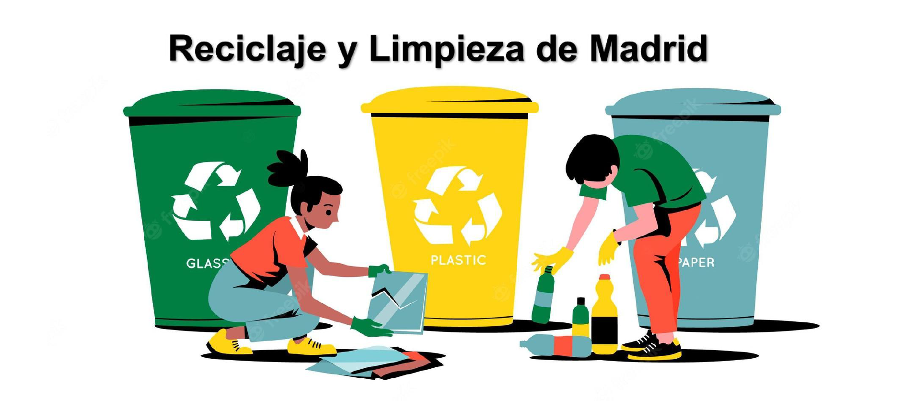

# 
Reciclaje y limpieza de Madrid

Estudio de análisis de datos sobre la limpieza y la gestión de basuras de Madrid

## Autores
[Mario Resa](https://github.com/Mario999X) y [Sebastián Mendoza](https://github.com/SebsMendoza)
## Resumen
El objetivo de la práctica es usar datos extraídos de la web [www.datos.madrid.es](https://datos.madrid.es/sites/v/index.jsp?vgnextoid=86e4ee950779d510VgnVCM2000001f4a900aRCRD&vgnextchannel=374512b9ace9f310VgnVCM100000171f5a0aRCRD) sobre recogida de residuos para realizar un informe con datos filtrados.
Para ello, nos hemos servido del lenguaje de programación Kotlin para diseñar la aplicación. Además, hemos hecho empleo de la tecnología DataFrame que, a nuestro parecer, encajaba mejor en nuestro proyecto, ya que nos parecía más ameno realizar las filtraciones con esta tecnología.
Nuestro proyecto se divide en 3 secciones: los controladores, los modelos y el Main.
* En el directorio *controllers*, tenemos la lógica principal de la app, en distintas clases objeto:
    * **DirController** Se encarga de comprobar la existencia y posibilidad de lectura/escritura de los directorios usados en la app.
    * Realizar las distintas operaciones según lo introducido por parámetros (Parser, resumen, resumen distrito)
* En el directorio *models*, tenemos los modelos usados en la app.
    * **Contenedores**, para el CSV de contenedores_varios
    * **Residuos**, para el CSV de modelo_residuos_2021
    * **Informe**, creado para bitacora.xml
* En **Main.kt**, hemos creado una función que acepta parámetros de entrada, guardando esos datos en un array de String y, según la posición de sus datos, realice las diferentes operaciones.
* PDF con la documentación completa en la carpeta **data**
## Herramientas usadas
* [Gradle](https://gradle.org/)
* [Dataframe](https://kotlin.github.io/dataframe/overview.html)
* [Serialization](https://github.com/pdvrieze/xmlutil)
* [JSON](https://kotlin.github.io/dataframe/write.html#writing-to-json)
* [CSV](https://kotlin.github.io/dataframe/write.html#writing-to-csv)
* [JUnit 5](https://junit.org/junit5/)
* [Lets-Plot](https://lets-plot.org/kotlin/-lets--plot--kotlin/org.jetbrains.letsPlot/index.html)
* [Dokka](https://github.com/Kotlin/dokka)
* [Logger](https://www.baeldung.com/kotlin/kotlin-logging-library)
* [Jar](https://www.baeldung.com/kotlin/gradle-executable-jar#fat-jar-for-the-lightweight-application)
## Video
* [Enlace al video explicativo](https://drive.google.com/file/d/1Pf1JYPBXwP78Ic8pn-CtlTcCOwAmYUw1/view?usp=sharing)